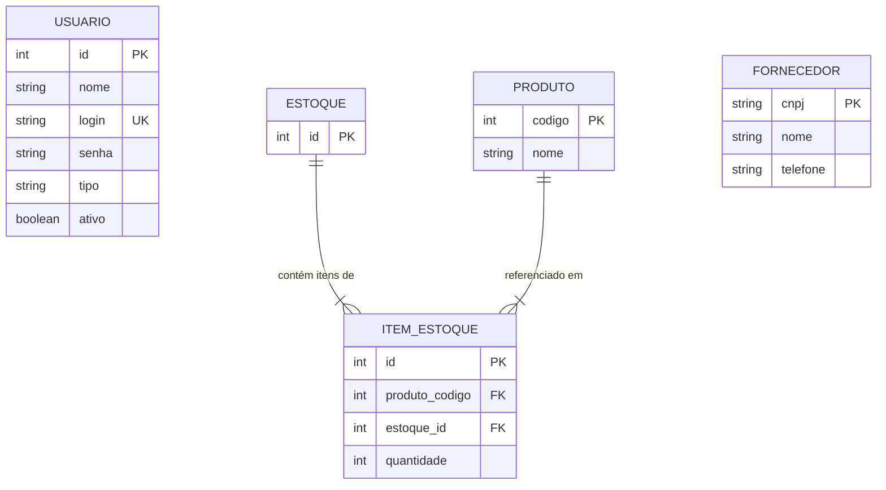

# Arquitetura: Banco de Dados (SQLite & ORM SQLAlchemy)

A camada de persistência do **G-Estoque** utiliza o banco relacional embutido **SQLite**, gerenciado de forma limpa e tipada pelo ORM **SQLAlchemy**. O modelo foi desenhado para garantir integridade referencial, velocidade de busca e escalabilidade estrutural.

---

## 🗺️ Diagrama Entidade-Relacionamento (ER)

O modelo relacional é estruturado em 5 entidades principais conectadas entre si:

---

## 🗃️ Detalhamento das Tabelas

### 1. Tabela `usuario` (`models/usuario.py`)
Armazena as contas com acesso de login ao sistema desktop.
- **`id`** *(Integer, Primary Key, Auto Increment)*: Identificador numérico único do operador.
- **`nome`** *(String)*: Nome completo do colaborador.
- **`login`** *(String, Unique, Index)*: Identificador alfanumérico exclusivo para entrada no app.
- **`senha`** *(String)*: Hash criptográfico salgado gerado pelo algoritmo Bcrypt (nunca armazena senha em texto plano).
- **`tipo`** *(String)*: Perfil de acesso hierárquico (`estoquista`, `gerente` ou `admin`).
- **`ativo`** *(Boolean)*: Status da conta, padrão `True`.

### 2. Tabela `produto` (`models/estoque.py`)
Catálogo mestre de todos os produtos ou peças da microempresa.
- **`codigo`** *(Integer, Primary Key, Index)*: Código interno numérico da peça (SKU).
- **`nome`** *(String)*: Nome ou descrição comercial do item.

### 3. Tabela `estoque` (`models/estoque.py`)
Entidade contêiner que representa o galpão ou acervo físico da empresa.
- **`id`** *(Integer, Primary Key)*: Identificador do acervo de estoque (padrão único ID `1`).

### 4. Tabela `item_estoque` (`models/estoque.py`)
Tabela associativa que relaciona as peças cadastradas na tabela `produto` com o galpão `estoque`, guardando o saldo físico em prateleira.
- **`id`** *(Integer, Primary Key, Auto Increment)*: ID do registro de alocação no acervo.
- **`produto_codigo`** *(Integer, Foreign Key -> `produto.codigo`)*: Chave estrangeira que conecta o item à descrição e código na tabela de produtos.
- **`estoque_id`** *(Integer, Foreign Key -> `estoque.id`)*: Chave estrangeira ligada ao acervo principal.
- **`quantidade`** *(Integer, Default 0)*: Saldo atualizado do item disponível em prateleira.

### 5. Tabela `fornecedores` (`models/gerente.py`)
Catálogo de parceiros e fornecedores de mercadorias.
- **`cnpj`** *(String, Primary Key, Index)*: Cadastro Nacional de Pessoa Jurídica que funciona como chave primária única.
- **`nome`** *(String)*: Razão social ou nome fantasia da empresa parceira.
- **`telefone`** *(String)*: Número de contato comercial ou celular do fornecedor.

---

## ⚙️ Inicialização do Banco (`setup.py`)

O script de setup localizado em `backend/setup.py` executa os seguintes passos na inicialização:
1. Conecta ao arquivo local `estoque.db`.
2. Invoca o comando `Base.metadata.create_all(bind=engine)`, que cria todas as tabelas acima se ainda não existirem.
3. Verifica se a coluna `ativo` existe na tabela `usuario` (adicionando-a via `ALTER TABLE` caso o banco venha de uma versão legada do projeto).
4. Verifica e realiza o seed das contas de teste (`estoquista`, `gerente` e `admin`), dos 10 produtos iniciais de exemplo, da vinculação na tabela `item_estoque` e dos 3 fornecedores padrões.
