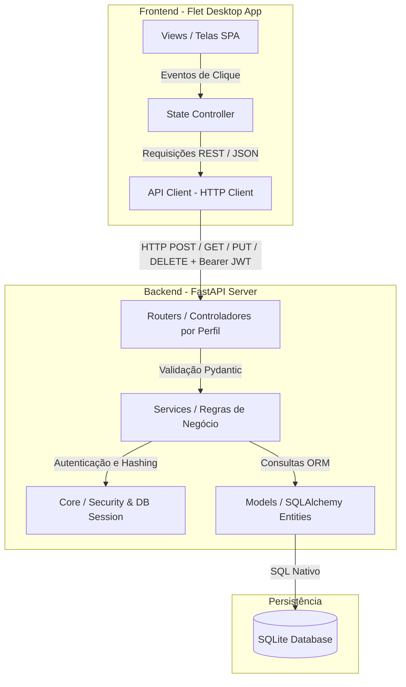

# Arquitetura: Visão Geral

O projeto **G-Estoque** foi concebido e implementado seguindo os princípios de **Arquitetura Limpa (Clean Architecture)** e **Separação de Responsabilidades (SoC)**. O sistema é estritamente dividido entre uma aplicação nativa de interface gráfica para o usuário final e uma API REST de backend que gerencia toda a regra de negócio e persistência de dados.

---

## 🏛️ Diagrama em Camadas do Sistema

A comunicação entre a interface do usuário e o banco de dados flui de maneira unidirecional através de camadas bem definidas, isolando regras de negócio da apresentação de UI:

---

## 🔄 Fluxo de Comunicação e Resiliência

1. **Desacoplamento UI/Backend:** O Flet é responsável unicamente pela renderização gráfica dos componentes em tela e controle de estado de componentes (campos de texto, botões, tabelas). Ele não realiza nenhuma lógica de acesso direto a arquivos de banco de dados ou criptografia.
2. **Cliente HTTP Centralizado:** Todas as requisições disparadas pelo Flet passam pela classe `ApiClient` em `frontend/api/client.py`. Essa classe é responsável por encapsular os timeouts, capturar exceções de conexão (ex: servidor desligado) e injetar automaticamente o cabeçalho de autorização `Authorization: Bearer <token>` em rotas protegidas.
3. **Mapeamento de Rotas por Cargos:** No backend, as rotas HTTP são segregadas em roteadores distintos com prefixos dedicados (`/estoquista`, `/gerente`, `/admin`), aplicando travas e heranças de acesso em nível de rota e serviço.
