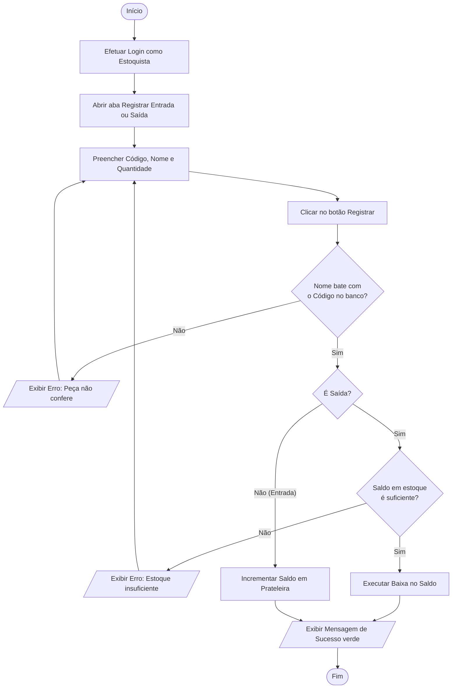
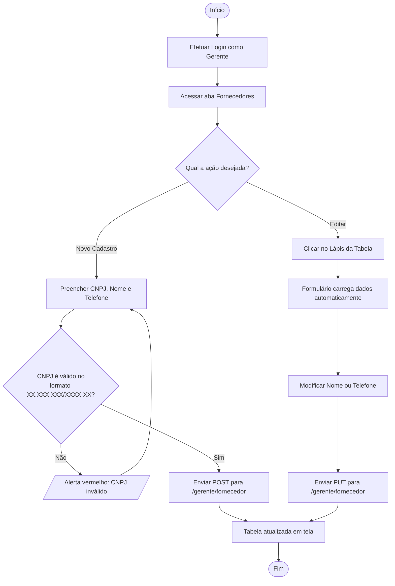
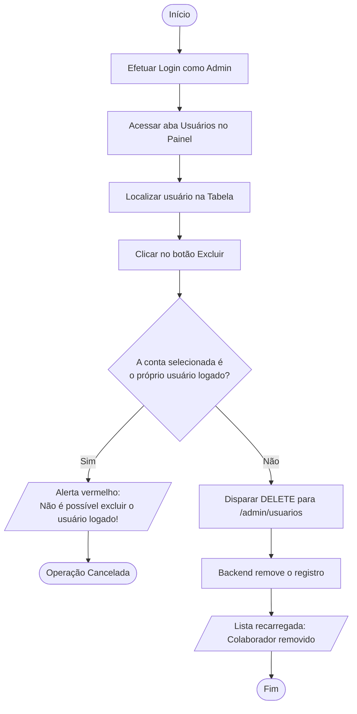

# Diagramas: Atividades

Este documento apresenta os **Diagramas de Atividades** referentes aos processos do sistema para os três níveis de acesso.

---

## Diagrama Oficial (PDF)

<object data="../assets/DIAGRAMA DE ATIVIDADE.pdf" type="application/pdf" width="100%" height="800px">
  
Seu navegador não suporta a visualização de PDFs. <a href="../assets/DIAGRAMA%20DE%20ATIVIDADE.pdf">Baixar PDF do Diagrama de Atividades</a>

</object>

---

## 1. Fluxo de Atividade: Estoquista (Movimentação de Peça)

---

## 2. Fluxo de Atividade: Gerente (Gestão de Fornecedor)

---

## 3. Fluxo de Atividade: Administrador (Exclusão Segura de Usuário)

