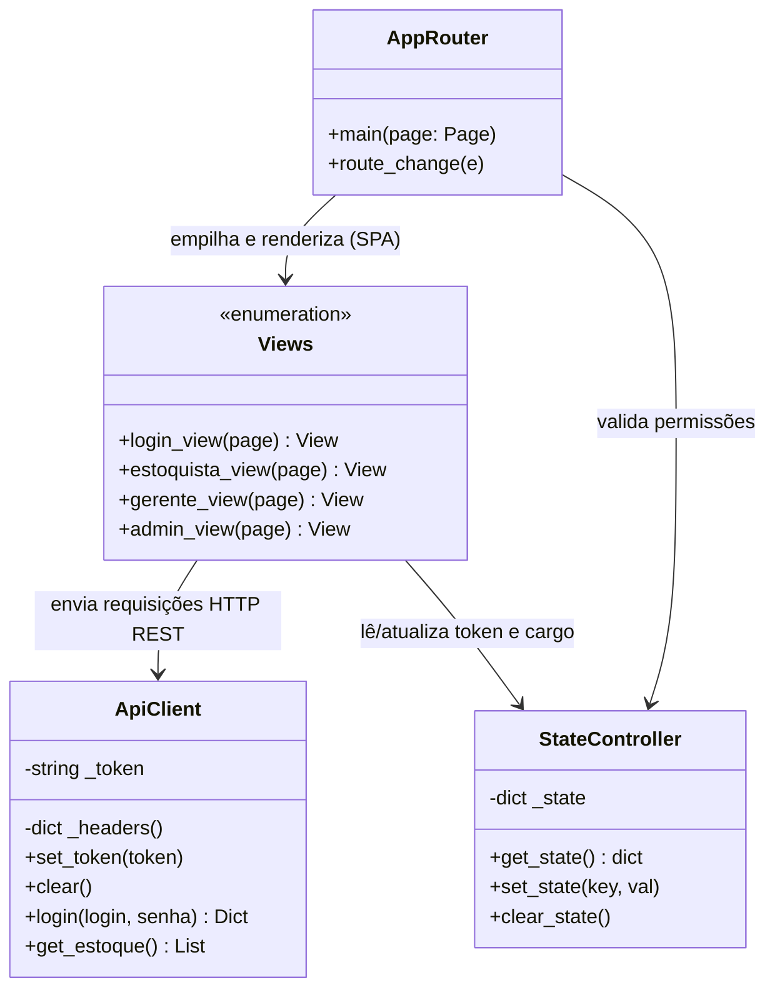

# Diagramas: Arquitetura de Classes

Este documento apresenta a modelagem estrutural do sistema através dos seus **Diagramas de Classe**.

---

## 🏛️ Diagrama Oficial de Classes

Abaixo está o diagrama de classes oficial do sistema, modelando as entidades, atributos e métodos principais da aplicação:

<object data="../assets/DIAGRAMA DE CLASSE.pdf" type="application/pdf" width="100%" height="800px">
  
Seu navegador não suporta a visualização de PDFs. <a href="../assets/DIAGRAMA%20DE%20CLASSE.pdf">Clique aqui para baixar o PDF do Diagrama de Classes.</a>

</object>

---

## Estrutura Complementar do Frontend (Flet)

No lado da apresentação desktop (`frontend/`), as responsabilidades foram organizadas para separar controle de sessão de renderização gráfica. Aqui está uma visualização complementar da arquitetura implementada:

