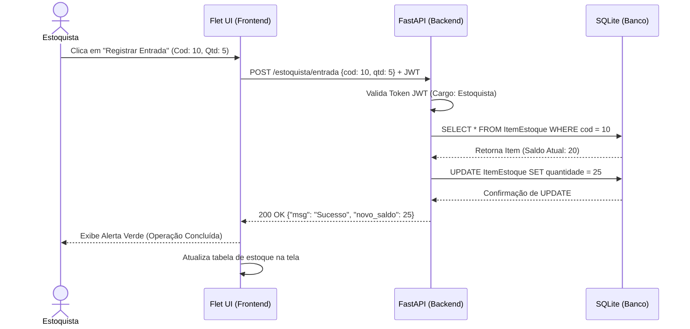
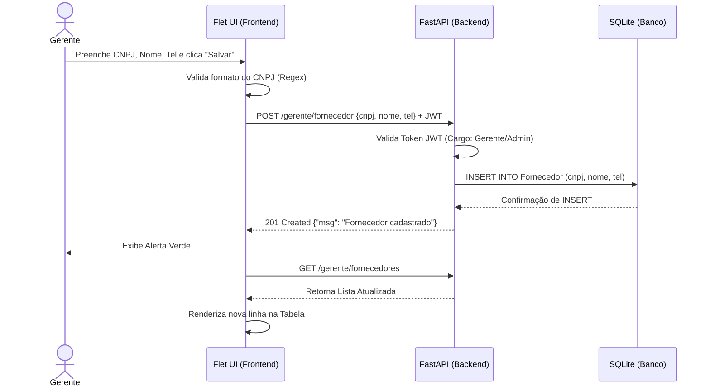
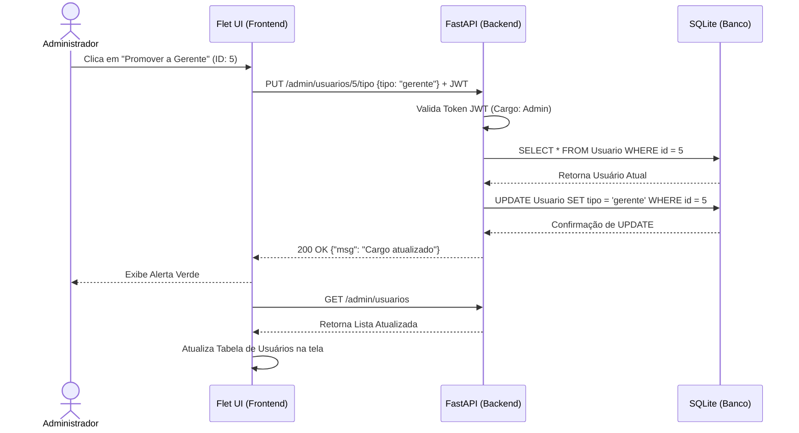

# Diagramas: Sequência

Este documento contém os **Diagramas de Sequência** detalhando as interações entre o usuário, a interface Flet, e a API FastAPI, focando nas operações de Estoquista, Gerente e Administrador.

---

## 1. Sequência: Estoquista (Movimentação de Estoque)

Este diagrama ilustra a comunicação cliente-servidor durante um registro de entrada de mercadorias.

<object data="../assets/DIGRAMA DE SEQUENCIA - ESTOQUISTA.pdf" type="application/pdf" width="100%" height="800px">
  
Seu navegador não suporta a visualização de PDFs. <a href="../assets/DIGRAMA%20DE%20SEQUENCIA%20-%20ESTOQUISTA.pdf">Baixar PDF</a>

</object>

**Fluxo em Mermaid:**

---

## 2. Sequência: Gerente (Gestão de Fornecedores)

Este fluxo demonstra a criação de um novo fornecedor pelo Gerente.

<object data="../assets/DIAGRAMA DE SEQUENCIA - GERENTE.pdf" type="application/pdf" width="100%" height="800px">
  
Seu navegador não suporta a visualização de PDFs. <a href="../assets/DIAGRAMA%20DE%20SEQUENCIA%20-%20GERENTE.pdf">Baixar PDF</a>

</object>

**Fluxo em Mermaid:**

---

## 3. Sequência: Administrador (Controle de Usuários)

Este fluxo detalha a alteração de cargo de um funcionário.

**Fluxo em Mermaid:**

